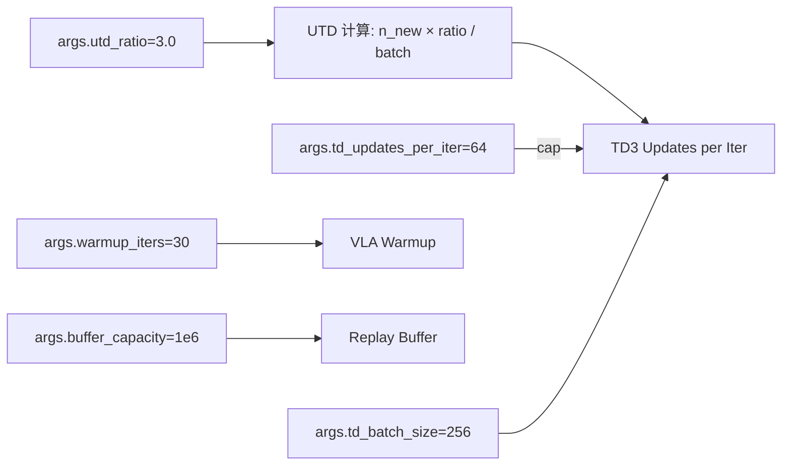

# RLAT 训练日志参数详解

## 1. Per-Chunk Timing（每个 chunk 的计时）

```
[TIMING] chunk 37: active=2 | vla=0.210s  enc+act=0.001s  store=0.000s  unnorm=0.000s  env_step=0.157s  chunk_total=0.374s
```

这些参数来自 [`action_token_rollout_fast.py:251-257`](../AlphaBrain/training/reinforcement_learning/algos/RLActionToken/action_token_rollout_fast.py:251) 的计时逻辑。该文件实现了 **step-lock 架构**（设计思想见文件第 1-13 行的注释），即所有并行环境以锁步方式同步推进。

### 字段含义

| 字段 | 值 | 含义 |
|---|---|---|
| **chunk 37** | — | 当前 rollout 分组（group）内的第 37 个决策块。每个 chunk 对应一次 VLA 推理 + 环境步进 |
| **active=2** | 2 | 当前活跃（尚未完成/失败）的环境数量。初始值 G=2（并行度），环境完成后逐渐减少 |
| **vla=0.210s** | 0.210 秒 | VLA 前向推理的 **累计平均时间**。注意：这是 `_t_vla_forward / _t_total_chunks` 的**运行均值**，不是单次耗时。具体代码在：[`action_token_rollout_fast.py:155-167`](../AlphaBrain/training/reinforcement_learning/algos/RLActionToken/action_token_rollout_fast.py:155) |
| **enc+act=0.001s** | 0.001 秒 | ActionToken 编码器（encoder）+ 策略网络（actor/critic）的前向推理**累计平均时间**。代码在：[`action_token_rollout_fast.py:170-191`](../AlphaBrain/training/reinforcement_learning/algos/RLActionToken/action_token_rollout_fast.py:170) |
| **store=0.000s** | ~0.000 秒 | 将 step 记录（`ActionTokenStepRecord`）存入 episode 的时间，代码在：[`action_token_rollout_fast.py:198-212`](../AlphaBrain/training/reinforcement_learning/algos/RLActionToken/action_token_rollout_fast.py:198) |
| **unnorm=0.000s** | ~0.000 秒 | 反归一化动作的时间，代码在：[`action_token_rollout_fast.py:215-220`](../AlphaBrain/training/reinforcement_learning/algos/RLActionToken/action_token_rollout_fast.py:215) |
| **env_step=0.157s** | 0.157 秒 | 环境执行 chunk 动作的时间（多线程并行执行所有活跃环境的 step），代码在：[`action_token_rollout_fast.py:222-248`](../AlphaBrain/training/reinforcement_learning/algos/RLActionToken/action_token_rollout_fast.py:222) |
| **chunk_total=0.374s** | 0.374 秒 | 该 chunk 从开始到结束的总耗时 = `time.time() - _t_chunk_start` |

### 性能解读

- **vla_forward (0.210s)** 占 chunk_total (0.374s) 的 **~56%**，是最大瓶颈，符合 VLA 模型参数多的特点
- **enc+act (0.001s)** 极快，因为 ActionToken 的 encoder+actor 远小于 VLA 骨干
- **env_step (0.157s)** 占比 **~42%**，包括环境物理仿真、图像渲染等，这部分受限于仿真引擎

---

## 2. TIMING SUMMARY（Rollout 分组汇总）

```
[TIMING SUMMARY] rollout group 809 | G=2 | 40 chunks | total=14.82s
  vla_forward:    8.39s (56.6%)  avg=0.210s/chunk
  encoder+actor:  0.06s (0.4%)  avg=0.001s/chunk
  store_records:  0.01s (0.1%)  avg=0.000s/chunk
  unnormalize:    0.01s (0.0%)  avg=0.000s/chunk
  env_step:       6.34s (42.8%)  avg=0.159s/chunk
  other/overhead: 0.02s
```

| 字段 | 含义 |
|---|---|
| **rollout group 809** | 这是第 809 个 rollout 分组。每个分组并行收集 G 个 episode |
| **G=2** | 该组的并行度（2 个环境同时运行） |
| **40 chunks** | 整个 rollout 分组总共用了 40 个 chunk 完成（说明平均每个 episode 约 20 个 chunk） |
| **total=14.82s** | 该组从 reset 到所有 episode 完成的总耗时 |
| **vla_forward: 8.39s (56.6%)** | VLA 推理总耗时 8.39 秒，占 56.6%，**是最大瓶颈** |
| **env_step: 6.34s (42.8%)** | 环境步进总耗时 6.34 秒，占 42.8%，第二大时间开销 |

---

## 3. Training Iteration Log（训练迭代日志）

```
Got 60 episodes (rollout batch 26) | SR=0.03 (best=0.13, avg=0.04) | buffer=61016/1000000 |
total_env_steps=487903 | td_steps=676
VLA warmup (26/30), buffer=61016 — skipping TD updates
TD3: 27 updates (UTD=2356×3.0/256→27) critic=0.0055 actor=0.6054 bc=2.5865 q_mean=-0.1818
wandb.log OK (step=26)
```

这些参数来自 [`train_rl_offpolicy.py:721-852`](../AlphaBrain/training/reinforcement_learning/trainers/train_rl_offpolicy.py:721)。

### 3.1 Rollout 结果

| 字段 | 值 | 含义 |
|---|---|---|
| **60 episodes** | 60 | 从 rollout 线程收到了 60 个 episode（任务数量 × 每组 episode 数） |
| **rollout batch 26** | 26 | 这是第 26 个 rollout batch |
| **SR=0.03** | 3% | 当前 batch 的 Success Rate（成功率）= 3% |
| **best=0.13** | 13% | 历史最佳 Success Rate = 13% |
| **avg=0.04** | 4% | 最近 20 个 batch 的移动平均 SR = 4% |
| **buffer=61016/1000000** | 61,016 / 1,000,000 | Replay Buffer 当前有 61,016 条 transition，总容量 1,000,000 |
| **total_env_steps=487903** | 487,903 | 从训练开始到现在的总环境步数（所有环境累计） |
| **td_steps=676** | 676 | 从训练开始到现在的累计 TD 梯度更新步数 |

### 3.2 VLA Warmup 阶段

```
VLA warmup (26/30), buffer=61016 — skipping TD updates
```

来自 [`train_rl_offpolicy.py:732-734`](../AlphaBrain/training/reinforcement_learning/trainers/train_rl_offpolicy.py:732)：

| 字段 | 含义 |
|---|---|
| **VLA warmup (26/30)** | 当前处于 VLA warmup 阶段第 **26 / 总共 30** 轮训练迭代。warmup 期间，rollout 使用纯 VLA 模型直接输出动作（跳过 actor 网络），目的是预填充 replay buffer |
| **skipping TD updates** | Warmup 期间跳过 TD3 策略优化（只收集数据，不训练） |
| **buffer=61016** | 已填充 61,016 条 transition，等 buffer 积累到一定量后开始 TD3 训练 |

Warmup 模式的控制逻辑在 [`action_token_rollout_fast.py:181-186`](../AlphaBrain/training/reinforcement_learning/algos/RLActionToken/action_token_rollout_fast.py:181)：

```python
if warmup_mode:
    # Warmup: use VLA actions directly, skip actor
    actions_t = vla_actions_for_actor
    log_probs = torch.zeros(...)
    values = torch.zeros(...)
```

### 3.3 TD3 更新统计

```
TD3: 27 updates (UTD=2356×3.0/256→27) critic=0.0055 actor=0.6054 bc=2.5865 q_mean=-0.1818
```

来自 [`train_rl_offpolicy.py:851-853`](../AlphaBrain/training/reinforcement_learning/trainers/train_rl_offpolicy.py:851)：

| 字段 | 含义 |
|---|---|
| **TD3: 27 updates** | 当前迭代（iteration）内执行了 27 次 TD3 梯度更新 |
| **UTD=2356×3.0/256→27** | **UTD 计算过程**：`n_updates = n_new_transitions × utd_ratio / batch_size`。即 2,356（新 push 的 transition 数）× 3.0（utd_ratio）/ 256（batch_size）≈ 27.6 → cap 到 27 |
| **UTD 参数来源** | `utd_ratio=3.0` 来自 [`train_args.py:92`](../AlphaBrain/training/reinforcement_learning/trainers/train_args.py:92) 的 `--utd_ratio` |
| **critic=0.0055** | 当前迭代中 Critic 网络 loss 的均值 |
| **actor=0.6054** | 当前迭代中 Actor 网络 loss 的均值（即 `-Q(s, a)`，越小表示 actor 的动作让 critic 评分越高） |
| **bc=2.5865** | BC（Behavior Cloning）惩罚项的均值。Actor 训练时会添加 BC 正则项防止偏离 VLA 行为。代码在 [`action_token_trainer.py`](../AlphaBrain/training/reinforcement_learning/algos/RLActionToken/action_token_trainer.py) 的 actor update 中 |
| **q_mean=-0.1818** | Critic 输出的 Q 值均值（负值说明当前策略下 critic 对 action 的价值估计为负，这通常是因为 reward 稀疏或策略还在早期探索阶段） |

### 3.4 Weight & Biases 日志

```
wandb.log OK (step=26)
```

当前 iteration（step=26）的指标已成功记录到 W&B。

---

## 4. 关键概念区分：Rollout Group vs. Training Iteration

**这是最容易混淆的部分，务必注意区分。**

### 4.1 Rollout Group（编号 809、847、899...）

这是 **per-chunk timing 中打印的 group 编号**，来自 [`action_token_rollout_fast.py:263`](../AlphaBrain/training/reinforcement_learning/algos/RLActionToken/action_token_rollout_fast.py:263) 的 `group_idx` 参数。

它的计算公式在 [`train_rl_offpolicy.py:634`](../AlphaBrain/training/reinforcement_learning/trainers/train_rl_offpolicy.py:634)：

```python
group_idx = it * n_tasks * n_rollout_gpus + gpu_id * n_tasks + tid
```

其中：
- **`it`** = rollout 线程内部的迭代计数器（从 1 到 max_iter 循环）
- **`n_tasks`** = 每次迭代处理的任务数
- **`n_rollout_gpus`** = 用于 roll out 的 GPU 数
- **`gpu_id`**、**`tid`** = 当前 GPU 和任务 ID

**group_idx 是全局单调递增的**，贯穿整个训练生命周期。它把每次迭代中所有 GPU × 所有任务产生的 rollout group 都编号进去。

### 4.2 Training Iteration（编号 26、27...30）

这是 [`train_rl_offpolicy.py:688`](../AlphaBrain/training/reinforcement_learning/trainers/train_rl_offpolicy.py:688) 中主训练循环的 `iteration` 计数器，与 rollout 线程通过 `Queue` 同步——主循环每次 `queue.get()` 等待一个 rollout batch，然后处理并打印日志。

**两者关系**：每次训练迭代对应一次完整的 rollout 迭代（所有 GPU 和任务的收集完成），然后主循环处理这批数据。所以：

- **训练 iteration 26** = 主循环处理了第 26 批 rollout 数据
- **这个第 26 批数据中**，某个 GPU 上的某个任务会产生一个 rollout group，其 `group_idx = 26 × n_tasks × n_rollout_gpus + ...`

例如如果 `n_tasks=4, n_rollout_gpus=8`（每迭代 32 个 group）：
- it=26 时，group 编号范围：25×32=800 到 831
- **group 809 = 800 + 2×4 + 1**，即 gpu_id=2, tid=1

这正是你在日志中看到的情况：**group 809 属于训练 iteration 26**，两者是对应的。

### 4.3 正确解读训练进度

```
VLA warmup (26/30)
```

**这是训练 iteration 26 / 总共 30 轮 warmup**，即 warmup 已完成 87%，接近尾声。到 iteration 30 时 warmup 结束，此后 rollout 的 `warmup_mode` 设为 False（代码见 [`train_rl_offpolicy.py:740`](../AlphaBrain/training/reinforcement_learning/trainers/train_rl_offpolicy.py:740)），actor 开始介入控制，同时 TD3 训练启动。

这也印证了你观察到的：**rollout group 到 899 左右时 warmup 结束**。因为：
- 假设 groups_per_iter = 4×8 = 32
- iter 30 的 group 范围：29×32=928 到 959
- 所以 group 899 在 iter 28 范围（27×32=864 到 895），**确实接近 warmup 尾声**

---

## 5. 关键参数配置关系



- **UTD (Update-To-Data) ratio**：每采集 1 条新 transition，训练时复用 `utd_ratio` 次。这里是 3.0，意味着每条数据平均训练 3 次。
- **warmup_iters**：Warmup 轮数（30），期间纯 VLA 采样填充 buffer，不训练 TD3。
