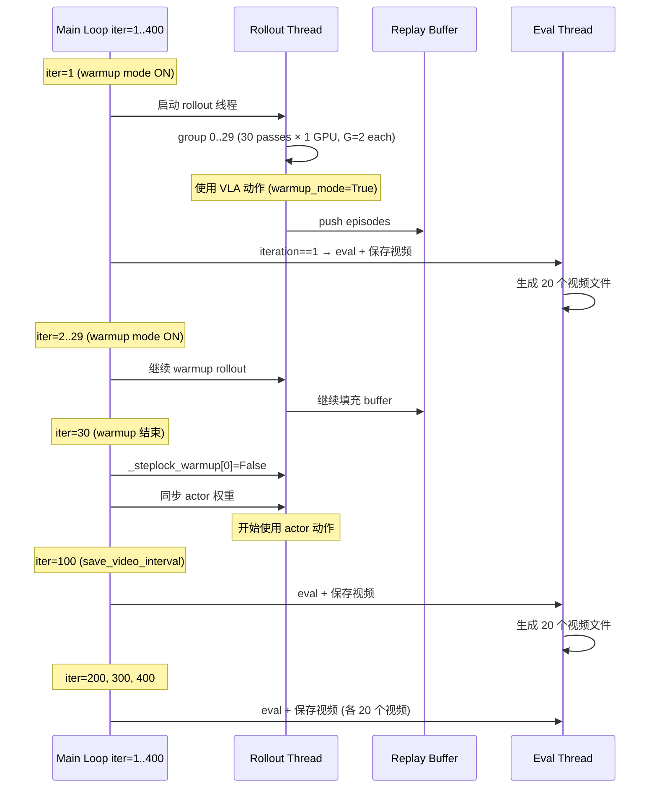

# RLAT Rollout Group 与 Eval 视频对应关系分析

## 1. 核心结论：两者完全独立

**Rollout group 和 eval 视频是两个完全不同的机制，没有直接的对应关系。**

- **Rollout group** = 训练数据收集单位，由 `_rollout_thread_fn` 生成，用于填充 replay buffer
- **Eval 视频** = 在 eval 阶段由 `_eval_deterministic_local` 生成，用于评估策略表现

---

## 2. Rollout Group 详解

### 来源

Timing summary 中的 `rollout group 207` 来自 [`action_token_rollout_fast.py:263`](AlphaBrain/training/reinforcement_learning/algos/RLActionToken/action_token_rollout_fast.py:263)：

```python
print(f"\n[TIMING SUMMARY] rollout group {group_idx} | G={G} | {_t_total_chunks} chunks | total={_t_rollout_total:.2f}s")
```

### group_idx 的计算方式

在 [`train_rl_offpolicy.py:561`](AlphaBrain/training/reinforcement_learning/trainers/train_rl_offpolicy.py:561)（step-lock 模式）：

```python
unique_group_idx = (it * n_passes + pass_idx) * n_rollout_gpus + gpu_id
```

其中：
- `it` = 当前迭代轮次（1-based）
- `n_passes` = `ceil(G_per_task / num_envs_per_task)`，当前配置下 `n_passes = ceil(60/2) = 30`
- `pass_idx` = 当前 pass（0-based），每次 iter 内从 0 到 n_passes-1
- `n_rollout_gpus` = rollout GPU 数量，当前配置 `--rollout_gpus 0` 所以 = 1
- `gpu_id` = GPU 编号

**例如 group 207**：
```
207 = (it × 30 + pass_idx) × 1 + 0
→ it × 30 + pass_idx = 207
```
由于 `pass_idx ∈ [0, 29]`，所以：
- `it = 6`（`floor(207/30) = 6`），因为 iteration 是 1-based，所以 group 207 出现在第 7 个 iteration
- `pass_idx = 207 % 30 = 27`

### G=2 的含义

`G=2` 表示这个 group 中每次 pass 收集 2 条轨迹。因为：
- `--num_envs_per_task 2`（每个任务 2 个持久环境）
- `--G_per_task 60`（每个任务 60 条轨迹/iter）
- `n_passes = 60/2 = 30` pass/iter
- 每个 pass 只处理 2 个 episode（与 `num_envs_per_task` 一致），30 个 pass 累计 60 条轨迹

但注意这里 `G=2` 是因为在 single-task 模式下，`G = G_per_task` 或 `G = G_per_pass`（当 G_per_task > num_envs_per_task 时，自动 chunk 成多个 pass，每个 pass 的 G = min(G_per_task, num_envs_per_task) = 2）。

---

## 3. Eval 视频详解

### 视频命名规则

你看到的视频路径：
```
eval_iter_00001/eval_s01_ep01_fail.mp4
```

来自 [`eval_helpers.py:111`](AlphaBrain/training/reinforcement_learning/eval/eval_helpers.py:111)：

```python
vpath = os.path.join(video_dir, f"eval_s{state_idx:02d}_ep{ep_idx:02d}_{status}.mp4")
```

- `s01` = `state_idx = ep_idx % 50`（初始状态索引，第 1 个 initial state）
- `ep01` = `ep_idx = 1`（eval 中的第 2 个 episode，0-based）
- `fail` = 该 episode 失败

### 视频保存时机

在 [`train_rl_offpolicy.py:906-910`](AlphaBrain/training/reinforcement_learning/trainers/train_rl_offpolicy.py:906)：

```python
do_eval = (args.eval_interval > 0
           and (iteration == 1 or iteration % args.eval_interval == 0))
save_video = (args.save_video_interval > 0 and
              (iteration == 1 or iteration % args.save_video_interval == 0))
```

Eval 运行条件：`iteration == 1` 或 `iteration % eval_interval == 0`
视频保存条件：`save_video_interval > 0` 且 `iteration == 1` 或 `iteration % save_video_interval == 0`

> **注意**：iteration 1 **总是**会保存视频（设计和 eval 间隔无关），即使 `eval_interval > 1`，iteration 1 也会触发 eval + 视频保存。

---

## 4. 回答你的三个问题

### Q1：rollout group 和视频的对应关系？

**没有对应关系。**

| 概念 | 用途 | 触发时机 | 视频文件名格式 |
|------|------|----------|--------------|
| Rollout group | 训练数据收集（填充 replay buffer） | 每个 iteration 的 rollout 阶段 | N/A（rollout 不保存视频） |
| Eval 视频 | 评估策略可视化 | 特定 iteration 的 eval 阶段 | `eval_s{state}_ep{ep_idx}_{status}.mp4` |

Rollout 代码 (`action_token_rollout_fast.py`) 虽然也支持保存视频（`video_dir` 参数），但在当前 offpolicy 训练流程中，rollout 调用时 `video_dir=None`，**rollout 不会保存任何视频**。所有视频都来自 eval 阶段。

### Q2：10 个 rollout group 保存一个视频？

**不是。** 这是两个完全独立的系统：

- 每个 rollout group 是 2 条轨迹的批量收集（G=2），不产生视频
- 视频只在 eval 时保存，与 rollout group 数量无关
- 视频数量 = `eval_n_episodes` × 有视频保存的 eval 次数

### Q3：`--warmup_iters 30` 会保存 500×30=1500 个视频？

**不会。** 这个计算有两个概念错误：

1. **Warmup 不产生视频。** `--warmup_iters 30` 控制的是前 30 个 iteration 使用 VLA 原生动作（跳过 actor）来填充 replay buffer。这与 eval 视频完全无关。

2. **视频数量不乘以 max_iter。** 视频只来自 eval，而 eval 只在 `eval_interval` 的整数倍 iteration 运行。

**实际视频数量计算**（以你的配置为例）：

假设配置（来自你的 `singletask_test` 运行）：
- `--eval_interval` 未知，但假设为常用值 10
- `--save_video_interval` 未知
- `--eval_n_episodes` 未知

假设典型值 `--eval_interval 10 --save_video_interval 100 --eval_n_episodes 20`：

| Iteration | 触发 eval? | 保存视频? | 视频数 |
|-----------|-----------|----------|--------|
| 1 | ✅（iteration==1 总是触发） | ✅（iteration==1 总是保存） | 20 |
| 10, 20, ..., 90 | ✅（每 10 iter） | ❌ | 0 |
| 100 | ✅ | ✅（每 100 iter） | 20 |
| 200 | ✅ | ✅ | 20 |
| 300 | ✅ | ✅ | 20 |
| 400 | ✅ | ✅ | 20 |

**总计 ≈ 5 × 20 = 100 个视频**，远少于 1500。

### 时序图



---

## 5. 如何验证

如果你想验证视频和 rollout group 的对应关系，可以通过 wandb 查看 `video/success` 和 `video/fail` 日志。在 [`train_rl_offpolicy.py:1017-1022`](AlphaBrain/training/reinforcement_learning/trainers/train_rl_offpolicy.py:1017)：

```python
for ep in sorted(all_episodes, key=lambda e: -e.success):
    if ep.video_path and os.path.exists(ep.video_path):
        status = "success" if ep.success else "fail"
        wandb_log[f"video/{status}"] = wandb.Video(
            ep.video_path, fps=10, format="mp4")
        break
```

注意这里只上传了 rollout 的 video_path（如果存在），不是 eval 视频。你的视频来自 eval 阶段，eval 的视频不会通过 wandb 上传（除非额外处理）。
